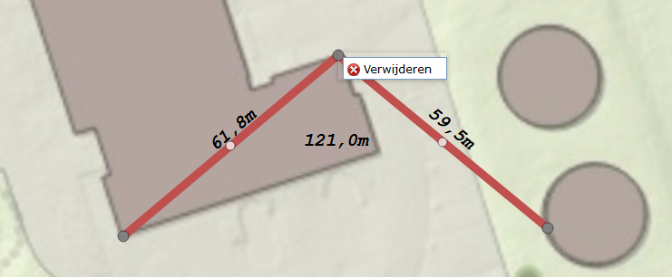

# Rolmaat
Portal for ArcGIS Enterprise/ArcGIS Online (Esri) WebApp Widget voor het meten van segmenten met interactieve meetgegevens.

Dit is de Nederlandse versie van [Measure Widget 2.4 for Web App Builder](https://community.esri.com/docs/DOC-3209-measure-widget-21-for-web-app-builder). Wij hebben alleen de user interface en de help vertaald. De functionaliteit is niet aangepast. Kijk [hier om de (Engelstalige versie van) de tool in actie te zien](https://gis.yakimawa.gov/measure/).

